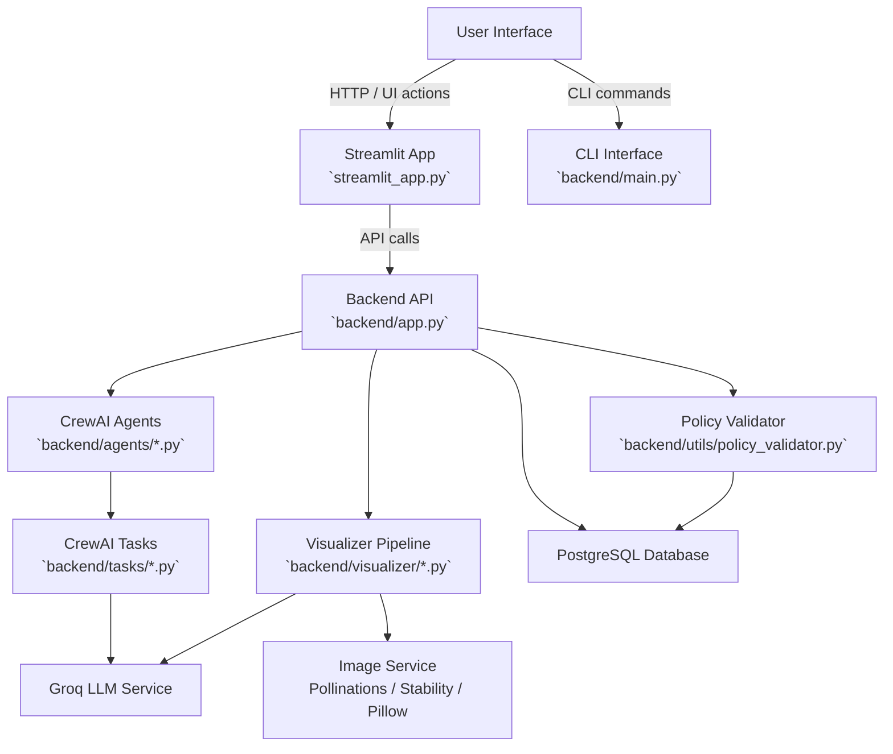
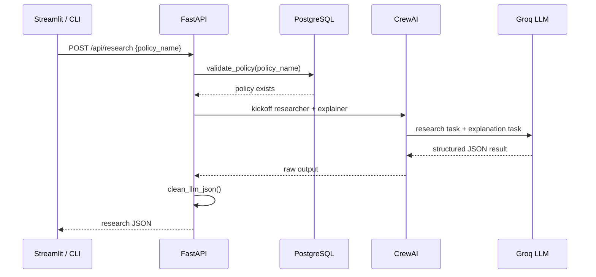
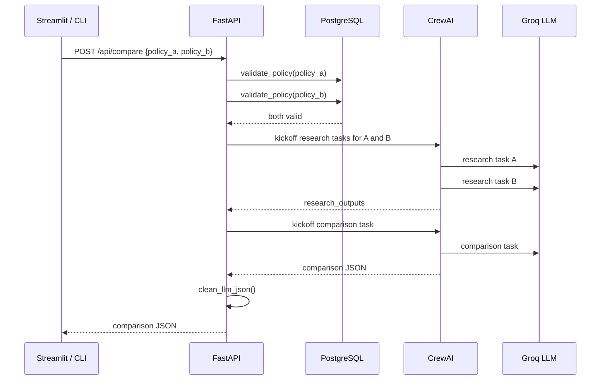
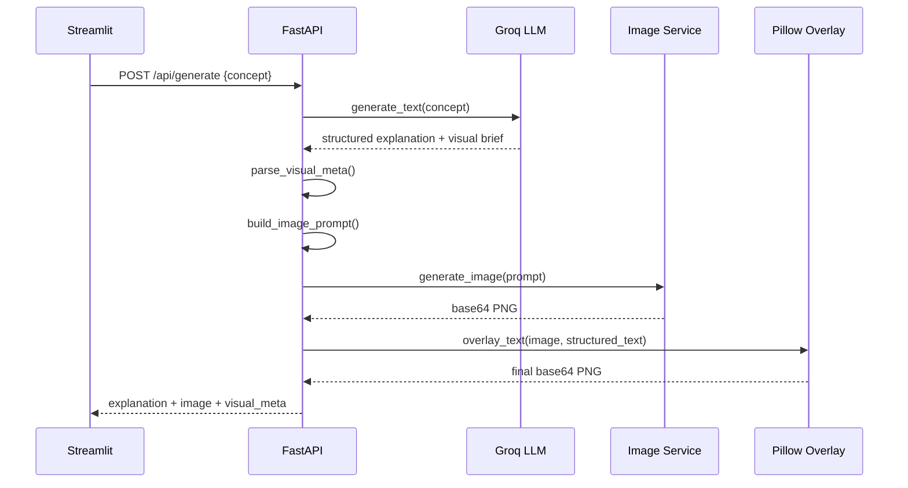

# Multi-Agent Insurance System Design Report

## 1. Overview

This report describes the architecture, major components, data flow, and detailed design of the `multi-agent-insurance` project. The system provides three main capabilities:

- Policy research: research a single insurance policy and summarize it.
- Policy comparison: compare two policies using structured research output.
- Concept visualization: generate an insurance concept explanation and image.

The system is implemented as a Python backend with a FastAPI HTTP API, a Streamlit frontend, and an optional CLI mode.

## 2. Architecture Summary

### 2.1 Core Logical Layers

- **Presentation / UI**
  - `streamlit_app.py`: Streamlit-based web UI for health checks, research, compare, and visualization.
  - `backend/main.py`: CLI menu-driven interface for local use.

- **API / Backend**
  - `backend/app.py`: FastAPI server exposing REST endpoints for policy research, policy comparison, and concept generation.

- **Orchestration / Agents**
  - `backend/agents/*.py`: CrewAI agent factory functions for researcher, explainer, and comparator agents.
  - `backend/tasks/*.py`: CrewAI task definitions that instruct agents to return structured JSON output.

- **Visualizer**
  - `backend/visualizer/*`: Responsible for building text/image prompts, generating concept visuals, and overlaying text on images.

- **Data / Persistence**
  - `backend/utils/policy_validator.py`: Validates policy names and loads available policies from a PostgreSQL `policiesdetails` table.

- **Configuration**
  - `backend/config/settings.py`: Configures the Groq LLM for CrewAI and the structured text generation pipeline.

### 2.2 External Dependencies

- **LLM service**: Groq LLaMA 3.3 via `GROQ_API_KEY`.
- **Image generation**: Pollinations AI (default), Stability AI SDXL (optional), or Pillow fallback.
- **Database**: PostgreSQL connection via `DATABASE_URL`.
- **Environment control**: `.env` variables such as `GROQ_API_KEY`, `HF_API_KEY`, `STABILITY_API_KEY`, `IMAGE_MODE`, `DATABASE_URL`, and `BACKEND_URL`.

## 3. High-Level Design (HLD)

### 3.1 System Components

- **User Interface**:
  - Browser-based Streamlit app calls backend endpoints.
  - CLI can run the same logic via Python and CrewAI.

- **API Layer**:
  - `GET /api/system/health`
  - `GET /api/policies`
  - `POST /api/research`
  - `POST /api/compare`
  - `POST /api/generate`

- **LLM/Agent Layer**:
  - `create_researcher()` agent for policy research.
  - `create_explainer()` agent for explanation generation.
  - `create_comparator()` agent for policy comparison.

- **Task Layer**:
  - `create_research_task(...)` produces strict JSON research output.
  - `create_explanation_task(...)` generates explanation output.
  - `create_comparison_task(...)` produces structured JSON comparison.

- **Visualizer Layer**:
  - `generate_text()` builds a text prompt and calls Groq.
  - `parse_visual_meta()` extracts image instruction fields.
  - `build_image_prompt()` assembles the final illustration prompt.
  - `generate_image()` requests an image from a chosen model.
  - `overlay_text()` applies infographic overlay boxes to the returned image.

### 3.2 HLD Component Diagram

### 3.3 High-Level Workflows

#### Policy Research Workflow

1. User selects a policy in Streamlit or enters a policy name in CLI.
2. API validates the policy against PostgreSQL.
3. `create_researcher()` and `create_explainer()` are created.
4. `create_research_task()` and `create_explanation_task()` are executed by CrewAI sequentially.
5. Result is cleaned and returned as JSON.

#### Policy Comparison Workflow

1. User selects two different policies.
2. API validates both policies.
3. `create_research_task()` runs for each policy sequentially.
4. `create_comparison_task()` is executed with both research outputs.
5. JSON comparison result is returned.

#### Concept Visualization Workflow

1. User submits a concept string.
2. `generate_text()` calls Groq to produce a text explanation and image brief.
3. `parse_visual_meta()` extracts image fields.
4. `build_image_prompt()` creates the model prompt.
. `generate_image()` requests the image.
5. `overlay_text()` draws the infographic overlay.
6. Final `data:image/png;base64,...` result returns to the UI.

## 4. Low-Level Design (LLD)

### 4.1 `backend/app.py`

#### API Endpoints

- `GET /api/system/health`
  - Returns readiness status for researcher, explainer, comparator, and LLM connectivity.

- `GET /api/policies`
  - Returns policy names from PostgreSQL.

- `POST /api/research`
  - Accepts `policy_name`.
  - Validates policy name.
  - Runs the researcher + explainer crew sequentially.
  - Returns cleaned JSON output.

- `POST /api/compare`
  - Accepts `policy_a` and `policy_b`.
  - Validates both policy names.
  - Runs research tasks for both policies.
  - Runs comparison task with structured research results.
  - Returns cleaned JSON output.

- `POST /api/generate`
  - Accepts `concept`.
  - Calls visualization pipeline.
  - Returns `concept`, `explanation`, `visual_meta`, and `image`.

#### Internal Helper

- `clean_llm_json(raw_output: str)`
  - Removes code fences and parses JSON.
  - Raises HTTP 500 if JSON is invalid.

### 4.2 `backend/main.py`

- Provides CLI menu and local orchestration.
- Uses same CrewAI orchestration as the API.
- Supports research, compare, policy listing, and exit.

### 4.3 Agents and Tasks

#### `backend/agents/*.py`

- `create_researcher()`
  - Role: Insurance Policy Research Specialist.
  - Goal: Research policy details.
  - Uses `backend/config/settings.get_llm()`.

- `create_explainer()`
  - Role: Insurance Advisor.
  - Goal: Simplify insurance policy concepts.

- `create_comparator()`
  - Role: Insurance Policy Comparison Specialist.
  - Goal: Compare policies analytically.

#### `backend/tasks/research_task.py`

- Creates a CrewAI `Task` with strict JSON output.
- Expected structure includes:
  - `policy_name`
  - `summary`
  - `coverage`
  - `premium`
  - `pros`
  - `cons`
  - `best_for`

#### `backend/tasks/comparison_task.py`

- Creates a CrewAI `Task` for structured comparison.
- Output JSON includes:
  - `comparison` object with premium, coverage, pros, cons, and recommendations.
  - `recommendation` summary.

### 4.4 Visualizer Design

#### `backend/visualizer/prompts.py`

- Builds text prompt for concept explanation and visual brief.
- Parses structured LLM output into fields:
  - `title`, `section1`..`section4`
  - `color_theme`, `image_subject`, `image_scene`, `image_action`, `image_style`, `image_details`

- Builds an image generation prompt from the parsed visual brief.

#### `backend/visualizer/text_generator.py`

- Calls Groq chat completion using `build_text_prompt(concept)`.
- Returns raw structured text output.

#### `backend/visualizer/image_generator.py`

- Executes one of three image generation modes:
  - `hf`: Pollinations AI
  - `sdxl`: Stability AI SDXL
  - `pillow`: Local placeholder image
- Fallback order: selected API mode, then Pillow placeholder.
- Returns a base64 PNG data URI.

#### `backend/visualizer/overlay_text.py`

- Decodes the base64 image.
- Parses structured explanation text.
- Draws title bar and four section boxes onto image.
- Encodes final PNG as base64.

### 4.5 Policy Validation and Data Access

#### `backend/utils/policy_validator.py`

- Connects to PostgreSQL via `psycopg2`.
- `validate_policy(user_input)` normalizes input and verifies policy existence.
- `get_all_policies()` returns sorted policy names.

### 4.6 Configuration

#### `backend/config/settings.py`

- Loads `.env` and validates `GROQ_API_KEY`.
- Creates a Groq LLM instance with model `groq/llama-3.3-70b-versatile`.
- Controls temperature, API key, and model selection.

## 5. Data Flow and Sequence Diagrams

### 5.1 Research Flow Sequence

### 5.2 Compare Flow Sequence

### 5.3 Concept Visualization Flow

## 6. Deployment & Running

### 6.1 Local Startup

- Backend: run `python backend/app.py` using FastAPI/Uvicorn in a Python environment.
- CLI mode: run `python backend/main.py`.
- Frontend: run `streamlit run streamlit_app.py`.

### 6.2 Container / Kubernetes

The repository contains deployment artifacts:

- `Dockerfile`
- `Dockerfile.frontend`
- `docker-compose.yml`
- `k8s/deployment.yaml`
- `k8s/service.yaml`
- `k8s/configmap.yaml`
- `k8s/secret.yaml`
- `k8s/frontend.yaml`

### 6.3 Environment Configuration

Required environment variables:

- `GROQ_API_KEY`
- `DATABASE_URL`
- `IMAGE_MODE` (defaults to `hf`)
- `HF_API_KEY` or `STABILITY_API_KEY` if using external image services
- `BACKEND_URL` for Streamlit to talk to the API

## 7. Design Considerations and Extensions

### 7.1 Separation of Concerns

- The current design separates:
  - policy research/comparison logic from
  - visual explanation generation.
- This is good for incremental extension and testing.

### 7.2 Extensibility

Possible improvements:

- Add explicit schema validation for agent JSON output.
- Add a caching layer for `get_all_policies()` and research results.
- Add a frontend route for generated visualization previews.
- Replace the simple `psycopg2` access layer with an ORM for richer data modeling.

### 7.3 Reliability

- `clean_llm_json()` is the main safety gate for malformed agent output.
- Visual generation includes fallback to a local Pillow fallback image.

## 8. Recommended Diagram Set

Use these diagrams to create the full HLD/LLD documentation:

1. System Component Diagram
2. Sequence Flow for Policy Research
3. Sequence Flow for Policy Comparison
4. Sequence Flow for Concept Visualization
5. Deployment Diagram with PostgreSQL and external AI services

## 9. Notes

- The API and CLI use the same underlying CrewAI orchestration, making the system reusable.
- The Streamlit UI is the primary front-end, but the backend is also accessible via direct API.
- The project is designed around `Crew`, `Agent`, and `Task` abstractions, with each task returning structured JSON.

---

*Generated from repository source files and current project structure.*
